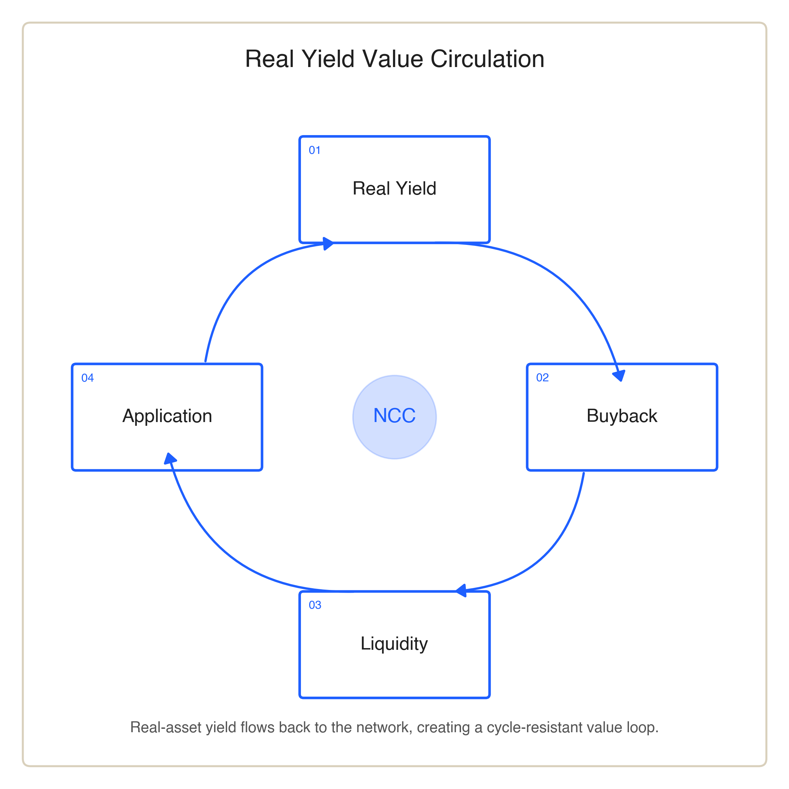

# Overview

NCC is a Web3 infrastructure ecosystem driven by Real-World Assets (RWAs). It is designed to coordinate value across real assets, on-chain liquidity, digital applications and consumer networks, building a digital-asset network grounded in real economic activity.

NCC's core objective is not to create an isolated token ecosystem, but to enable real assets to circulate on-chain and on-chain value to extend into real economic activity, through a standardized RWA infrastructure, a unified liquidity engine, a Marketplace, a PayFi network and the NCC Identity Layer.

## Core Positioning

NCC connects on-chain value with real-world economic activity, and builds the Web3 infrastructure layer for real-asset liquidity and consumer applications.

Within the NCC framework, RWAs supply real-world assets and yield as the value foundation; the Unified Liquidity Engine handles asset circulation and price discovery; the Marketplace and PayFi network provide use cases; and the NCC Identity Layer carries on-chain identity, reputation and access permissions. Together, these layers form a value loop grounded in real yield, asset liquidity and consumer participation.

## Core Value

Bring real-world assets on-chain in a verifiable, tradable and settlement-ready digital form.

Give on-chain assets real-world use cases, beyond mere holding and trading.

Make consumer activity an integral part of the on-chain value network, sustaining circulation between digital assets and real economic activity.

Build long-term Web3 infrastructure through foundation governance, risk control and ecosystem collaboration.

NCC's value loop does not rely on any single scenario, but is shaped jointly by assets, liquidity, applications and identity. Real yield provides the value foundation, liquidity enhances asset efficiency, applications drive use-case demand, the identity layer accumulates user relationships, and Foundation governance coordinates long-term direction.

<figure><figcaption>
Figure 3 · The NCC value loop
</figcaption></figure>

This structure gives NCC stronger adaptability across market cycles. When markets focus on yield, RWAs supply the value base; when markets focus on application traction, the Marketplace and PayFi provide use cases; when markets focus on governance and compliance, the Foundation and the Trust & Security Framework provide institutional support.
