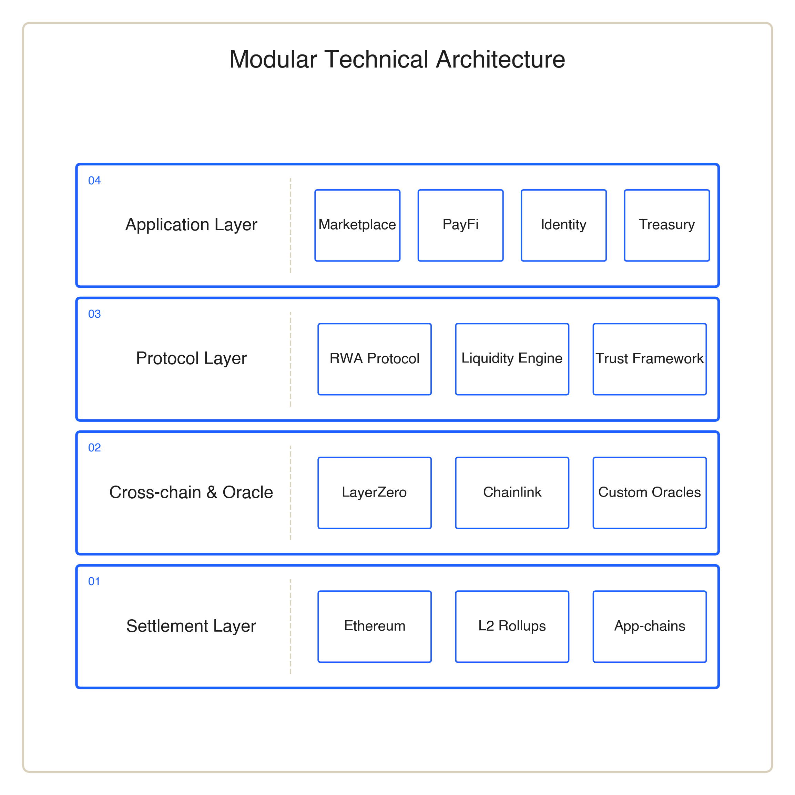

# Technical Infrastructure

## Multi-chain & Modular Architecture

<figure><figcaption>
Figure 5 · NCC's multi-chain modular technical stack
</figcaption></figure>

NCC adopts a multi-chain, modular architecture to meet the differing demands of RWAs, liquidity, applications and identity. Ethereum and the EVM ecosystem provide asset consensus and open-finance interfaces. Layer 2 networks support low-cost, high-frequency interactions. Purpose-built or industry chains accommodate compliance, privacy and institutional use cases.

The goal of multi-chain architecture is not to create complexity, but to let different asset and application types run on the most suitable infrastructure, while cross-chain messaging, asset mapping and identity verification deliver a unified experience.

## Oracle & Data Synchronization

For RWAs, the authenticity and timeliness of off-chain data are critical. NCC's oracle system synchronizes asset states, yield data, price information and risk parameters. Allowing on-chain smart contracts to execute settlement, distribution and risk control based on verifiable data.

## DID & Identity Infrastructure

The NCC Identity Layer and DID infrastructure together form the foundation for user identity, access permissions and reputation systems. This makes user behavior and rights composable across applications, providing the identity foundation for PayFi, Marketplace and governance.

The core principle of NCC's technical architecture is modularity, composability and evolvability. Rather than compressing all capabilities into a single system, NCC layers its design according to the distinct demands of assets, transactions, identity and applications. So that each module can iterate independently while remaining coordinated through unified protocols.

This architecture also leaves space for future integration of external protocols and third-party applications. Developers can build new applications around the Marketplace, PayFi, Identity Layer or liquidity modules. Without needing to rebuild the full asset-and-identity stack.
