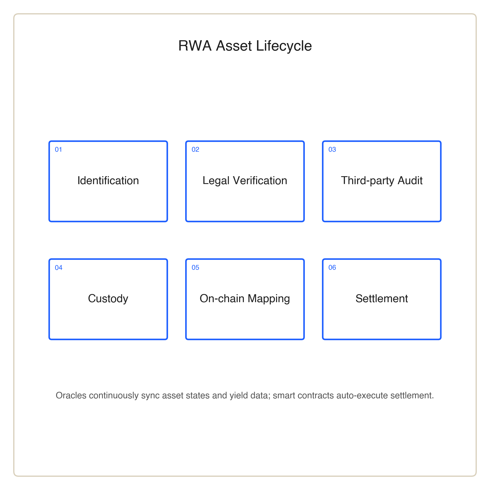

# RWA Infrastructure Layer

## Tokenization Is Not Enough

Bringing RWAs on-chain is not merely about wrapping a real asset into a token. It requires solving asset ownership, risk assessment, yield confirmation, data synchronization and on-chain settlement. The NCC-RWA Protocol is designed around the full asset lifecycle, ensuring every core asset entering the ecosystem is verifiable, traceable and settlement-ready.

## Asset Lifecycle

<figure><figcaption>
Figure 2 · The RWA asset lifecycle inside the NCC protocol
</figcaption></figure>

Within NCC's RWA framework, an asset first establishes ownership and yield relationships through a legal structure. Third-party institutions then assess and audit asset value, cash flow, risk profile and operational data. After entering custody or a bankruptcy-remote structure, the asset is mapped on-chain into corresponding digital rights or asset certificates.

Asset state and yield data are synchronized on-chain via the oracle system. Smart contracts execute yield distribution, risk alerts, liquidation triggers and other settlement logic according to predefined rules. Through this mechanism, the blockchain is not merely a registry. It becomes the automated coordination layer for real assets in the digital network.

## Supported Asset Categories

The NCC RWA framework can accommodate a wide range of assets with real yield or value backing. Including real-estate yield rights, supply-chain financial assets, debt receivables, commodity yield rights, intellectual-property income and commercial rights tied to consumer scenarios.

These assets do not exist in isolation. They can enter the Unified Liquidity Engine, the Marketplace and the PayFi network, becoming the foundation of the broader value loop.

Asset onboarding is the critical step in RWA infrastructure. NCC prioritizes asset provenance, yield structure, legal relationships and risk disclosure over raw asset volume. Only assets with clear ownership, verifiable cash flows and sustainable operations are suitable as long-term value sources for the ecosystem.
